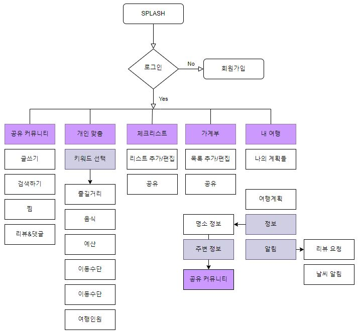
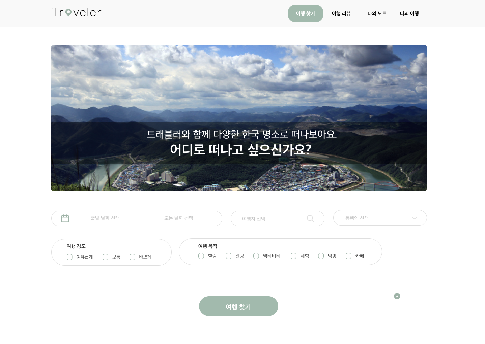
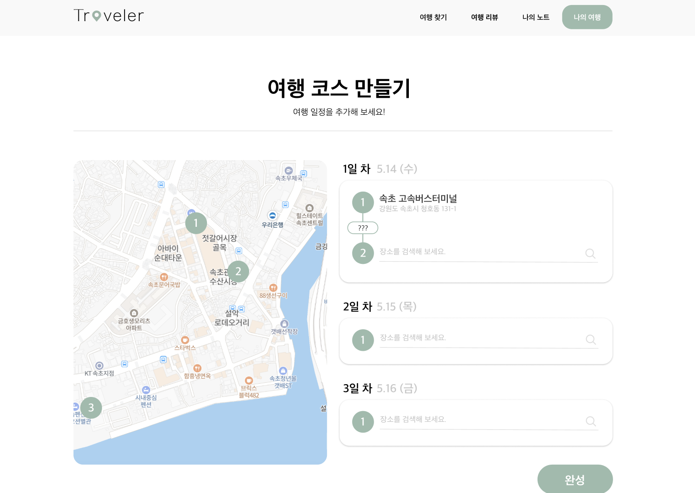
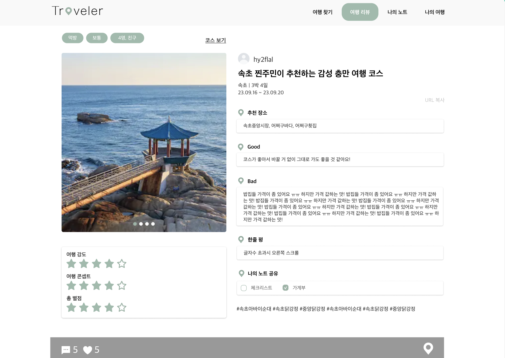
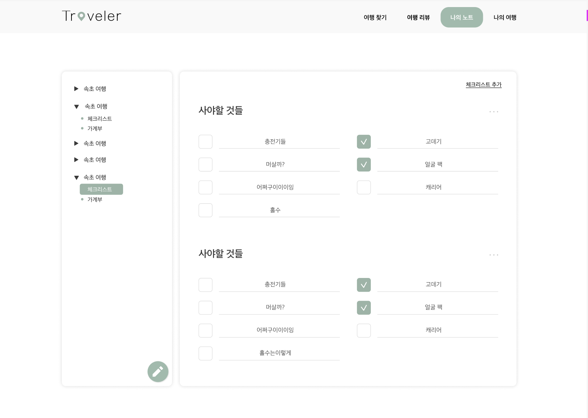
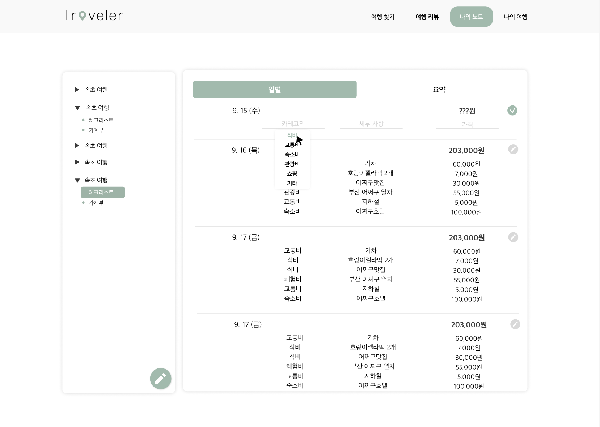
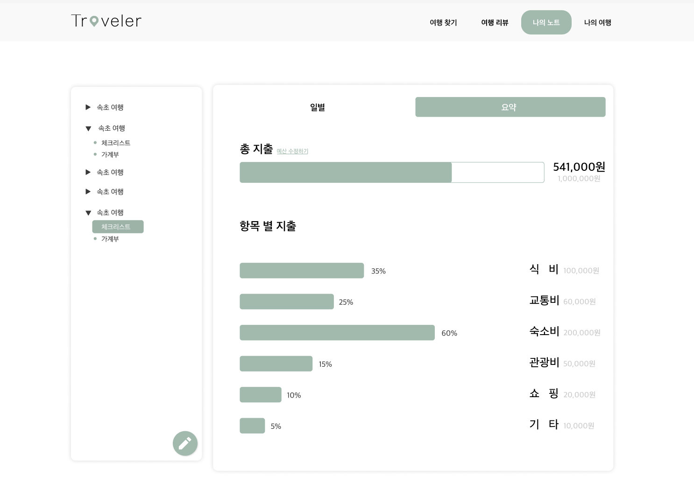

# ✈️ Traveler - 여행 계획 스케줄링 및 후기 공유 커뮤니티 프로젝트

## ✨ Key Features
- 사용자 맞춤 여행지 추천
- 준비물 및 예산 관리 기능
- 커뮤니티를 통한 여행 후기 공유

## 📚 Contents
1. [👀 서비스 소개](#-서비스-소개)
2. [⛰️ 아키텍처](#-☃️-아키텍처) 
3. [🌟 주요 기능](#-주요-기능)
4. [🛠️ 문제 및 해결](#-문제-및-해결)

## 👀 서비스 소개
- 여행 계획을 작성하는데 불편함을 겪는 사람들을 위해 여행 계획을 제공하는 서비스입니다.
- 여행지 추천, 공유 커뮤니티, 체크리스트 및 가게부를 제공합니다.

## ⛰️ 서비스 플로우

## 🌟 주요 기능

### 1. 여행지 추천
- 사용자의 여행 강도, 목적 선택을 통해 맞춤 여행지 내 맞춤 장소 추천
- 사용자가 직접 여행 경로 추가

### 2. 공유 커뮤니티
- 다녀온 여행 후기 공유
- 다른 사람의 여행 후기에 대한 댓글 및 조아요

### 3. 체크리스트 및 가게부
- 여행별 준비물 확인을 위한 체크리스트
- 효율적인 예산 관리를 위한 가계부

